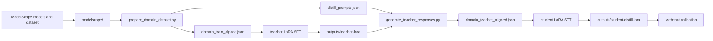

# 技术原理与架构说明

## 1. 总体思路

TaskFoundry 使用“两阶段 LoRA + response-based distillation”来构建小模型的
垂直领域能力：

1. 把原始领域数据转换为 Alpaca 格式
2. 用较大的 teacher 基座模型做第一阶段 LoRA SFT
3. 让微调后的 teacher 回答一批蒸馏 prompts
4. 把 prompt + teacher answer 组成新的 SFT 数据
5. 用这些数据训练较小的 student 模型

部署时保留：

- 基座模型
- LoRA adapter

这样可以降低磁盘占用，也便于后续只替换 adapter。

## 2. 架构总览



## 3. 目录角色

```text
llm_distill_law/
  configs/      # LLaMA-Factory YAML 训练配置
  data/         # 数据集映射与训练中间文件
  docs/         # 文档
  scripts/      # 下载、转换、蒸馏、评测脚本
  modelscope/   # 本地模型和数据集缓存
  outputs/      # LoRA 输出目录
```

`modelscope/` 是离线训练的关键资产目录。训练配置中的模型路径均指向
`/workspace/modelscope/models/...`，容器运行时通过宿主机目录挂载到
`/workspace`。

## 4. 数据处理原理

`prepare_domain_dataset.py` 会把原始样本转换为统一的 Alpaca 结构：

```json
{
  "instruction": "用户问题或任务描述",
  "input": "",
  "output": "参考回答",
  "system": "领域系统提示词"
}
```

处理逻辑包括：

- 兼容多种字段名，例如 `instruction/question/query/prompt`
- 兼容平铺问答和 `messages` 聊天格式
- 过滤空样本、乱码、过短和过长样本
- 使用 `(instruction, input)` 去重
- 固定随机种子打乱
- 额外导出蒸馏 prompts

## 5. LoRA 微调原理

LoRA 通过在原模型线性层旁边注入低秩矩阵，只训练增量参数而不是整模型参数。
这样能显著降低：

- 显存占用
- 磁盘占用
- 训练成本

当前模板默认配置：

```yaml
finetuning_type: lora
lora_rank: 16
lora_alpha: 32
lora_dropout: 0.05
lora_target: all
```

这是一组偏稳妥的通用默认值。

## 6. Response-Based Distillation

本项目采用输出对齐蒸馏，也就是让 student 学 teacher 的回答，而不是直接学原始
人工答案。

流程：

1. teacher 在目标领域数据上先完成 LoRA 微调
2. teacher 读取 `distill_prompts.json`
3. teacher 生成新的高一致性回答
4. 这些回答写入 `domain_teacher_aligned.json`
5. student 用该文件做第二阶段 SFT

这种方式的好处是 student 学到的是 teacher 微调后的输出分布、表达风格和任务边界。

## 7. 训练流水线

`run_all.sh` 是统一入口，按顺序执行：

1. `download_modelscope_assets.py`
2. `prepare_domain_dataset.py`
3. `llamafactory-cli train configs/qwen3_teacher_lora_sft.yaml`
4. `generate_teacher_responses.py`
5. `llamafactory-cli train configs/qwen3_student_distill_lora_sft.yaml`

所有步骤都运行在同一个 Docker 镜像中，减少宿主机环境差异。

## 8. 自动化评测

`evaluate_models.py` 会：

1. 读取用户自定义 benchmark
2. 顺序加载一个或多个模型
3. 逐题生成回答
4. 计算轻量自动指标
5. 导出 JSON / Markdown / Excel 报告

这些指标适合做交付前的第一层筛查，不应替代业务专家复核。

## 9. 离线架构

推荐把离线交付拆成两层：

```text
taskfoundry_bundle/
  llamafactory-0.9.4.tar
  taskfoundry_assets.tar.zst
  offline_restore.sh
  OFFLINE_MANIFEST.md
  SHA256SUMS
```

其中：

- `llamafactory-0.9.4.tar` 提供运行时
- `taskfoundry_assets.tar.zst` 提供代码、模型、数据和配置
- `offline_restore.sh` 负责恢复

## 10. 公开模板与项目实例的边界

为了让仓库适合公开复用，建议不要把这些内容长期放进主分支：

- 具体主机地址
- 某张显卡的实测记录
- 真实业务测试集
- 远端同步回来的评测结果
- 未完成训练产生的 checkpoint 和日志

把它们放到私有制品库或交付归档里，会更清爽也更安全。
